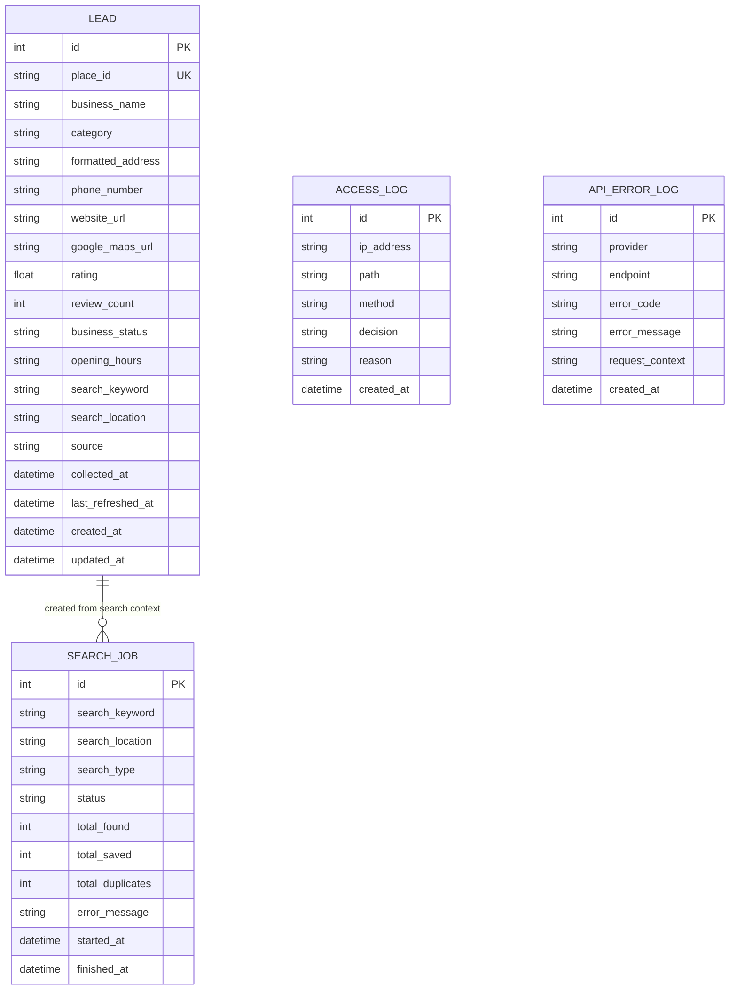

# Google Maps Lead Collection MVP - Office LAN Only PRD

## 1. Project Overview

- **Service Name**: Google Maps Lead Collection MVP - Office LAN Only
- **Core Concept**: An office-internal web application for collecting B2B lead information through the official Google Places API, storing it locally, deduplicating it, and exporting it for business use.
- **Project Type**: full-stack local web app / admin tool
- **Primary Target Users**: office administrator or business development staff working from the approved office LAN.
- **Service Scope**: internal office network only; initial lead searches focused on configurable countries, cities, areas, categories, and keywords.
- **Core Value Proposition**:
  - Collect leads legally through Google Places API instead of scraping Google Maps UI.
  - Store useful business information locally with deduplication by Google Place ID.
  - Keep the tool restricted to the office LAN and protect the Google API key server-side.

## 2. Module Definitions

| Module ID | Module Name | Description | Included Features | Dependent Modules |
|---|---|---|---|---|
| access-control | Access Control | Office LAN allowlist, admin login, denied access handling, access logs | IP CIDR allowlist, admin session, 403 page, access logs | - |
| dashboard | Dashboard | Operational summary and LAN/server status overview | saved lead counts, duplicate counts, last search, API errors, CIDR summary | access-control, lead-management, search-collection |
| search-collection | Google Places Search Collection | Server-side Google Places searches and local persistence | text search, nearby search, field masks, search jobs, deduplication, API error logs | access-control |
| lead-management | Lead Management | Browse, filter, sort, view, and delete collected leads | lead list, filters, sorting, detail view, delete selected leads | access-control, search-collection |
| export | Export | CSV and Excel downloads for all or filtered leads | CSV export, XLSX export, export filenames, export folder creation | access-control, lead-management |
| settings-logs | Settings and Logs | Runtime settings, API key visibility status, network status, access logs | settings page, network status API, access logs page, API error summary | access-control |

## 3. User Roles and Permission Matrix

### 3.1 Role Definitions

| Role | Description | Signup/Creation Condition |
|---|---|---|
| GUEST | Unauthenticated visitor from an allowed or blocked IP address | Any request before admin login |
| ADMIN | Internal office user allowed to operate the lead collection tool | Created through configured `ADMIN_USERNAME` and `ADMIN_PASSWORD_HASH` |

### 3.2 Feature-Level Permissions

| Feature | GUEST | ADMIN |
|---|---|---|
| View access denied page | Allowed | Allowed |
| Login to admin session | Allowed from allowed CIDR | Allowed |
| View dashboard | Forbidden | Allowed |
| Run Places search preview | Forbidden | Allowed |
| Collect leads | Forbidden | Allowed |
| Stop current search job | Forbidden | Allowed |
| View lead list | Forbidden | Allowed |
| View lead detail | Forbidden | Allowed |
| Delete leads | Forbidden | Allowed |
| Export CSV/XLSX | Forbidden | Allowed |
| View settings and logs | Forbidden | Allowed |
| Health check | Allowed from localhost or allowed CIDR | Allowed |

## 4. Screen/Page/View List

| Screen ID | Screen Name | URL/Path | Allowed Roles | Module | Description |
|---|---|---|---|---|---|
| SCR-ACCESS-01 | Login | `/login` | GUEST | access-control | Admin login form for allowed office network users |
| SCR-ACCESS-02 | Access Denied | `/403` | GUEST, ADMIN | access-control | 403 page for requests outside approved CIDRs |
| SCR-DASH-01 | Dashboard | `/` | ADMIN | dashboard | Summary of saved leads, duplicates, API errors, network status |
| SCR-SEARCH-01 | Search Collection | `/search` | ADMIN | search-collection | Search form, preview, collection controls, current job state |
| SCR-LEADS-01 | Lead List | `/leads` | ADMIN | lead-management | Filterable and sortable table of collected leads |
| SCR-LEADS-02 | Lead Detail | `/leads/[id]` | ADMIN | lead-management | Full lead details and delete action |
| SCR-EXPORT-01 | Export | `/export` | ADMIN | export | CSV/XLSX export options and export history |
| SCR-SETTINGS-01 | Settings | `/settings` | ADMIN | settings-logs | App mode, allowed CIDRs, private IP guidance, API key status, DB path |
| SCR-LOGS-01 | Access Logs | `/logs/access` | ADMIN | settings-logs | Access allow/block records |

## 5. Module-Specific Functional Requirements

### 5.1 access-control Module

#### Feature List

| Feature ID | Feature Name | Screen | Role | Priority | Description |
|---|---|---|---|---|---|
| F-ACCESS-01 | IP CIDR allowlist middleware | internal | GUEST, ADMIN | P0 | Check every page and API request against `OFFICE_ALLOWED_CIDRS` and fail closed to localhost-only when invalid or empty |
| F-ACCESS-02 | Admin login session | SCR-ACCESS-01 | GUEST, ADMIN | P0 | Require admin login before accessing operational screens or APIs |
| F-ACCESS-03 | Access denied response | SCR-ACCESS-02 | GUEST, ADMIN | P0 | Return 403 and show office-only restriction message for blocked IPs |
| F-ACCESS-04 | Access log persistence | internal | ADMIN | P0 | Store allowed and denied request logs in `access_logs` |
| F-ACCESS-05 | Office start command | internal | ADMIN | P0 | Provide `npm run start:office` binding to `0.0.0.0:3000` |

#### User Flows

| Flow ID | Flow Name | Steps | Success Condition |
|---|---|---|---|
| UF-ACCESS-01 | Allowed admin login | Allowed office user opens `/login`, enters admin credentials, app creates session, redirects to dashboard | Dashboard opens |
| UF-ACCESS-02 | Block external IP | Non-allowed IP requests any page or API, middleware rejects request, access log is written | User sees 403 page or API 403 response |

#### Edge Cases

- Empty `OFFICE_ALLOWED_CIDRS` -> allow localhost only and use error code E-ACCESS-01 for blocked non-localhost requests.
- Invalid CIDR config -> fail closed to localhost only and log reason with E-ACCESS-02.
- `TRUST_PROXY=false` with spoofed `X-Forwarded-For` -> ignore forwarded header.

### 5.2 dashboard Module

#### Feature List

| Feature ID | Feature Name | Screen | Role | Priority | Description |
|---|---|---|---|---|---|
| F-DASH-01 | Dashboard metrics | SCR-DASH-01 | ADMIN | P0 | Show total leads, leads collected today, duplicates skipped, last search time, recent API errors |
| F-DASH-02 | Network summary | SCR-DASH-01 | ADMIN | P0 | Show current allowed CIDR range and private IP access guidance |

#### User Flows

| Flow ID | Flow Name | Steps | Success Condition |
|---|---|---|---|
| UF-DASH-01 | Review operations | Admin opens dashboard and reviews current data, errors, and network configuration summary | Current metrics render without exposing secrets |

#### Edge Cases

- No leads exist -> show zero state without errors.
- No API errors exist -> show empty recent API errors state.

### 5.3 search-collection Module

#### Feature List

| Feature ID | Feature Name | Screen | Role | Priority | Description |
|---|---|---|---|---|---|
| F-SEARCH-01 | Search form | SCR-SEARCH-01 | ADMIN | P0 | Accept country, city/area, keyword, search type, radius, and max results |
| F-SEARCH-02 | Text Search | SCR-SEARCH-01 | ADMIN | P0 | Run server-side Google Places Text Search |
| F-SEARCH-03 | Nearby Search | SCR-SEARCH-01 | ADMIN | P0 | Run server-side Google Places Nearby Search using a location and radius |
| F-SEARCH-04 | Field mask management | internal | ADMIN | P0 | Use `GOOGLE_PLACES_FIELD_MASK` from server environment |
| F-SEARCH-05 | Deduplicate and save leads | internal | ADMIN | P0 | Save unique leads by Google Place ID and count duplicates |
| F-SEARCH-06 | Search job logging | internal | ADMIN | P0 | Persist search job status, totals, and errors |
| F-SEARCH-07 | API error logging | internal | ADMIN | P0 | Persist provider errors without exposing API keys |

#### User Flows

| Flow ID | Flow Name | Steps | Success Condition |
|---|---|---|---|
| UF-SEARCH-01 | Collect text search leads | Admin enters location and keyword, chooses Text Search, previews or collects results, backend saves unique leads | Search job finishes with saved and duplicate counts |
| UF-SEARCH-02 | Collect nearby leads | Admin enters location, radius, and keyword/category, chooses Nearby Search, backend saves unique leads | Search job finishes and dashboard counts update |

#### Edge Cases

- Missing Google API key -> E-SEARCH-01.
- Google API error -> E-SEARCH-02 and `api_error_logs` entry.
- Duplicate Google Place ID -> count duplicate, do not insert a new lead.
- Max results exceeds configured limit -> E-SEARCH-03.

### 5.4 lead-management Module

#### Feature List

| Feature ID | Feature Name | Screen | Role | Priority | Description |
|---|---|---|---|---|---|
| F-LEADS-01 | Lead table | SCR-LEADS-01 | ADMIN | P0 | Show saved leads in a paginated table |
| F-LEADS-02 | Lead filters and sorting | SCR-LEADS-01 | ADMIN | P0 | Filter by keyword, area, category, rating, website availability, and phone availability |
| F-LEADS-03 | Lead detail | SCR-LEADS-02 | ADMIN | P0 | Show all stored fields for one lead |
| F-LEADS-04 | Delete lead | SCR-LEADS-01, SCR-LEADS-02 | ADMIN | P0 | Delete selected leads or one detail record |

#### User Flows

| Flow ID | Flow Name | Steps | Success Condition |
|---|---|---|---|
| UF-LEADS-01 | Find filtered leads | Admin opens leads page, applies filters and sort, opens detail | Matching leads and detail render |
| UF-LEADS-02 | Delete lead | Admin selects a lead and confirms delete | Lead is removed from the table and database |

#### Edge Cases

- Lead not found -> E-LEADS-01.
- Invalid filter values -> E-LEADS-02.
- Delete confirmation cancelled -> no DB change.

### 5.5 export Module

#### Feature List

| Feature ID | Feature Name | Screen | Role | Priority | Description |
|---|---|---|---|---|---|
| F-EXPORT-01 | CSV export | SCR-EXPORT-01 | ADMIN | P0 | Download all or filtered leads as CSV |
| F-EXPORT-02 | Excel export | SCR-EXPORT-01 | ADMIN | P0 | Download all or filtered leads as XLSX |
| F-EXPORT-03 | Export filename convention | internal | ADMIN | P0 | Use names such as `leads_philippines_makati_restaurant_2026-06-02.csv` |
| F-EXPORT-04 | Export folder creation | internal | ADMIN | P1 | Ensure configured export folder exists |

#### User Flows

| Flow ID | Flow Name | Steps | Success Condition |
|---|---|---|---|
| UF-EXPORT-01 | Export filtered leads | Admin chooses filtered export and format, backend streams file | Browser downloads expected file |

#### Edge Cases

- No leads match export filters -> export valid empty file with headers.
- Export folder unavailable -> E-EXPORT-01.

### 5.6 settings-logs Module

#### Feature List

| Feature ID | Feature Name | Screen | Role | Priority | Description |
|---|---|---|---|---|---|
| F-SETTINGS-01 | Settings display | SCR-SETTINGS-01 | ADMIN | P0 | Show app mode, CIDRs, internal access URL guidance, DB path, export path, and API key configured status |
| F-SETTINGS-02 | API key masking | SCR-SETTINGS-01 | ADMIN | P0 | Never display raw key; optionally show only last four characters |
| F-LOGS-01 | Access logs view | SCR-LOGS-01 | ADMIN | P0 | Show request timestamp, IP, path, decision, and reason |
| F-LOGS-02 | Network status API | internal | ADMIN | P0 | Return current IP/CIDR status without secrets |

#### User Flows

| Flow ID | Flow Name | Steps | Success Condition |
|---|---|---|---|
| UF-SETTINGS-01 | Verify configuration | Admin opens settings to check app mode, CIDR, API key status, DB path, and export path | Settings render with secrets masked |
| UF-LOGS-01 | Review blocked access | Admin opens access logs and filters recent blocked requests | Blocked requests are visible |

#### Edge Cases

- API key missing -> display "not configured" without exposing env values.
- Log table empty -> show empty state.

## 6. Data Model

### 6.1 Entity Relationship Diagram

### 6.2 Entity Definitions

#### Lead

| Field | Type | Required | Description |
|---|---|---|---|
| id | integer | O | Primary key |
| place_id | text | O | Unique Google Place ID |
| business_name | text | O | Business display name |
| category | text | - | Primary category or type |
| formatted_address | text | O | Human-readable address |
| phone_number | text | - | Local or international phone number |
| website_url | text | - | Website URL |
| google_maps_url | text | - | Google Maps URL |
| rating | real | - | Google rating |
| review_count | integer | - | Google review count |
| business_status | text | - | Google business status |
| opening_hours | text | - | Serialized opening hours summary |
| search_keyword | text | O | Keyword used when collected |
| search_location | text | O | Location used when collected |
| source | text | O | Fixed value `google_places_api` |
| collected_at | datetime | O | Collection timestamp |
| last_refreshed_at | datetime | - | Last update from Places API |
| created_at | datetime | O | Record creation timestamp |
| updated_at | datetime | O | Record update timestamp |

#### SearchJob

| Field | Type | Required | Description |
|---|---|---|---|
| id | integer | O | Primary key |
| search_keyword | text | O | Keyword searched |
| search_location | text | O | Location searched |
| search_type | enum SearchType | O | Text or nearby search |
| status | enum SearchJobStatus | O | Current job state |
| total_found | integer | - | Total results returned by provider |
| total_saved | integer | - | New leads saved |
| total_duplicates | integer | - | Duplicate leads skipped |
| error_message | text | - | Final error summary, if any |
| started_at | datetime | O | Start timestamp |
| finished_at | datetime | - | Finish timestamp |

#### AccessLog

| Field | Type | Required | Description |
|---|---|---|---|
| id | integer | O | Primary key |
| ip_address | text | O | Detected request IP |
| path | text | O | Request path |
| method | text | O | HTTP method |
| decision | enum AccessDecision | O | Allowed or blocked |
| reason | text | - | Decision reason |
| created_at | datetime | O | Log timestamp |

#### ApiErrorLog

| Field | Type | Required | Description |
|---|---|---|---|
| id | integer | O | Primary key |
| provider | text | O | External provider name |
| endpoint | text | - | Provider endpoint or app API path |
| error_code | text | - | Provider or app error code |
| error_message | text | - | Sanitized error message |
| request_context | text | - | Sanitized request context without secrets |
| created_at | datetime | O | Log timestamp |

### 6.3 Enum Definitions

| Enum Name | Owning Module | Value | Label | Description |
|---|---|---|---|---|
| SearchType | search-collection | TEXT_SEARCH | Text Search | Google Places Text Search |
| SearchType | search-collection | NEARBY_SEARCH | Nearby Search | Google Places Nearby Search |
| SearchJobStatus | search-collection | PENDING | Pending | Job created but not started |
| SearchJobStatus | search-collection | RUNNING | Running | Job is calling Google Places API |
| SearchJobStatus | search-collection | COMPLETED | Completed | Job completed successfully |
| SearchJobStatus | search-collection | FAILED | Failed | Job failed with an error |
| SearchJobStatus | search-collection | CANCELLED | Cancelled | Job was stopped by admin |
| AccessDecision | access-control | ALLOWED | Allowed | Request passed allowlist |
| AccessDecision | access-control | BLOCKED | Blocked | Request failed allowlist or policy |
| LeadSource | search-collection | google_places_api | Google Places API | Lead came from official Google Places API |

## 7. State Transition Rules

### SearchJob.status

| Current State | Event/Action | Next State | Allowed Roles | Policy/Error Code |
|---|---|---|---|---|
| PENDING | Start job | RUNNING | ADMIN | SEARCH-P-01 |
| RUNNING | Provider returns success | COMPLETED | system | SEARCH-P-01 |
| RUNNING | Provider or validation error | FAILED | system | E-SEARCH-02 |
| RUNNING | Admin stops job | CANCELLED | ADMIN | SEARCH-P-04 |
| COMPLETED | Any mutation | COMPLETED | none | E-SEARCH-04 |
| FAILED | Any mutation | FAILED | none | E-SEARCH-04 |
| CANCELLED | Any mutation | CANCELLED | none | E-SEARCH-04 |

## 8. Business Logic and Policies

| Policy ID | Policy Name | Rule | Applies To | Error Code |
|---|---|---|---|---|
| ACCESS-P-01 | Office CIDR allowlist | Every page and API request must be allowed only when request IP is in `OFFICE_ALLOWED_CIDRS`; empty or invalid CIDRs allow localhost only | all routes | E-ACCESS-01, E-ACCESS-02 |
| ACCESS-P-02 | Public IP block | If `BLOCK_PUBLIC_ACCESS=true`, public IP ranges are blocked even if misconfigured | all routes | E-ACCESS-03 |
| ACCESS-P-03 | Proxy trust default | Ignore `X-Forwarded-For` unless `TRUST_PROXY=true` | IP detection | E-ACCESS-04 |
| AUTH-P-01 | Admin session required | Operational pages and APIs require valid admin session after CIDR allowlist passes | protected pages/APIs | E-AUTH-01, E-AUTH-02 |
| SEARCH-P-01 | Server-side Places only | Google Places API calls must occur only on the server; raw API key must never appear in frontend code or responses | Places APIs | E-SEARCH-01 |
| SEARCH-P-02 | Field mask limitation | Request only fields listed in `GOOGLE_PLACES_FIELD_MASK` | Places service | E-SEARCH-05 |
| SEARCH-P-03 | Deduplication by Place ID | Save no more than one lead per `place_id`; duplicates increment duplicate count | lead save | E-LEADS-03 |
| SEARCH-P-04 | Max results control | Search request `maxResults` must be between 1 and 60 for MVP cost control | Places search | E-SEARCH-03 |
| EXPORT-P-01 | Export format | Export format must be `csv` or `xlsx`; generated files include headers | export API | E-EXPORT-02 |
| SETTINGS-P-01 | Secret masking | Google API key and session secret must not be displayed; only configured status or final 4 characters may appear | settings UI/API | E-SETTINGS-01 |

## 9. API Endpoint List

| Endpoint ID | Method | Path | Module | Auth Required | Request | Response | Error Codes |
|---|---|---|---|---|---|---|---|
| API-DASH-01 | GET | `/` | dashboard | yes | none | dashboard HTML | E-ACCESS-01, E-AUTH-01 |
| API-LEADS-UI-01 | GET | `/leads` | lead-management | yes | query filters | lead list HTML | E-ACCESS-01, E-AUTH-01 |
| API-AUTH-01 | POST | `/api/auth/login` | access-control | no | username, password | session created | E-ACCESS-01, E-AUTH-02 |
| API-AUTH-02 | POST | `/api/auth/logout` | access-control | yes | none | session cleared | E-AUTH-01 |
| API-SEARCH-01 | POST | `/api/places/search` | search-collection | yes | country, cityArea, keyword, searchType, radius, maxResults | search job totals and saved leads | E-SEARCH-01, E-SEARCH-02, E-SEARCH-03 |
| API-LEADS-01 | GET | `/api/leads` | lead-management | yes | filters, pagination, sort | paginated leads | E-LEADS-02 |
| API-LEADS-02 | GET | `/api/leads/:id` | lead-management | yes | lead id | lead detail | E-LEADS-01 |
| API-LEADS-03 | DELETE | `/api/leads/:id` | lead-management | yes | lead id | delete result | E-LEADS-01 |
| API-EXPORT-01 | GET | `/api/export/csv` | export | yes | filters | CSV file | E-EXPORT-01, E-EXPORT-02 |
| API-EXPORT-02 | GET | `/api/export/xlsx` | export | yes | filters | XLSX file | E-EXPORT-01, E-EXPORT-02 |
| API-NETWORK-01 | GET | `/api/network/status` | settings-logs | yes | none | CIDR and server status without secrets | E-AUTH-01 |
| API-LOGS-01 | GET | `/api/logs/access` | settings-logs | yes | filters, pagination | paginated access logs | E-AUTH-01 |
| API-HEALTH-01 | GET | `/health` | access-control | no | none | app and DB health | E-ACCESS-01 |

## 10. External Service Integrations

| Service | Purpose | Environment | Required Keys | Failure Handling |
|---|---|---|---|---|
| Google Places API | Business search through Text Search and Nearby Search | dev/office production | `GOOGLE_MAPS_API_KEY`, `GOOGLE_PLACES_FIELD_MASK` | Log sanitized error in `api_error_logs`, return E-SEARCH-02, do not expose key |

## 11. Error Codes and Messages

| Error Code | HTTP Status | Message | Trigger Condition | User-Facing Message |
|---|---:|---|---|---|
| E-ACCESS-01 | 403 | IP address is not in allowed CIDR list | Request IP outside allowlist | This application is restricted to the approved office network only. Your IP address is not allowed. |
| E-ACCESS-02 | 403 | Invalid CIDR configuration; fail closed | `OFFICE_ALLOWED_CIDRS` cannot be parsed | Office network configuration is invalid. Localhost access only is allowed. |
| E-ACCESS-03 | 403 | Public IP blocked | Public IP detected while public access is blocked | This application cannot be accessed from a public network. |
| E-ACCESS-04 | 403 | Untrusted forwarded IP ignored | `X-Forwarded-For` supplied while `TRUST_PROXY=false` | Request source could not be trusted. |
| E-AUTH-01 | 401 | Admin session required | Protected route without valid session | Please log in as admin. |
| E-AUTH-02 | 401 | Invalid admin credentials | Login username or password invalid | Invalid username or password. |
| E-SEARCH-01 | 500 | Google API key is not configured | Missing server-side `GOOGLE_MAPS_API_KEY` | Google Places API is not configured. |
| E-SEARCH-02 | 502 | Google Places API request failed | Provider error or network error | Google Places search failed. Please check the logs. |
| E-SEARCH-03 | 400 | Invalid max results | Max results outside 1 to 60 | Max results must be between 1 and 60. |
| E-SEARCH-04 | 409 | Search job state transition is not allowed | Attempt to mutate terminal job state | This search job can no longer be changed. |
| E-SEARCH-05 | 400 | Invalid field mask | Field mask includes unsupported or empty fields | Google Places field mask is invalid. |
| E-LEADS-01 | 404 | Lead not found | Requested lead ID does not exist | Lead not found. |
| E-LEADS-02 | 400 | Invalid lead filter | Filter or sort parameter invalid | One or more filters are invalid. |
| E-LEADS-03 | 409 | Duplicate place ID | Insert attempted for existing `place_id` | Duplicate lead skipped. |
| E-EXPORT-01 | 500 | Export directory unavailable | Export folder cannot be created or written | Export folder is unavailable. |
| E-EXPORT-02 | 400 | Unsupported export format | Format is not csv or xlsx | Export format is not supported. |
| E-SETTINGS-01 | 500 | Secret exposure prevented | Attempt to display raw secret | Sensitive configuration cannot be displayed. |

## 12. Notification/Event System

| Event ID | Event Name | Trigger | Recipient | Channel | Payload |
|---|---|---|---|---|---|
| EVT-SEARCH-01 | Search job completed | Search job reaches COMPLETED | ADMIN | internal UI | search job id, totals, finished time |
| EVT-SEARCH-02 | Search job failed | Search job reaches FAILED | ADMIN | internal UI | search job id, sanitized error |
| EVT-ACCESS-01 | Access blocked | Request fails CIDR allowlist | ADMIN | access log | IP, path, method, reason |

## 13. Non-Functional Requirements

### 13.1 Performance

- Page load target: primary admin pages load within 2 seconds on the office LAN with up to 10,000 leads.
- API response target: list/filter APIs respond within 1 second for typical filters with indexed SQLite queries.
- Concurrent users: 1 to 5 internal office users for MVP.

### 13.2 Security

- Authentication: admin username/password session using hashed password and `SESSION_SECRET`.
- Authorization: only ADMIN can access operational pages and APIs.
- Input validation: all API inputs validated server-side with explicit schemas.
- Secrets handling: Google API key, password hash, and session secret stored only in `.env.local`; never returned to browser.
- Network restriction: application CIDR allowlist plus OS firewall/router policy.

### 13.3 Deployment / Infrastructure

- Hosting: local office host PC or mini server only; no public cloud deployment.
- Database: local SQLite database at `DATABASE_URL=file:./data/leads.sqlite`.
- Environment separation: `.env.example` for template, `.env.local` for real local office values.
- Monitoring: dashboard metrics, access logs, API error logs, health endpoint.

### 13.4 Reliability / Operations

- Backup: document SQLite file backup before migrations or major changes.
- Rollback: provide `ROLLBACK.md` with app and DB restore steps.
- Logging: access logs, API error logs, search job logs.
- Alerting: N/A for MVP; no external notification service. Admin checks dashboard/log pages.

## 14. MVP / Phase Definition

| Phase | Scope | Included Features | Excluded Features | Success Criteria |
|---|---|---|---|---|
| MVP | Office LAN-only Google Places lead collection | Access control, admin login, dashboard, search collection, lead management, CSV/XLSX export, settings/logs, README/firewall docs, rollback docs | email/SMS automation, CRM automation, SaaS, payments, public deployment, tunneling, Maps UI scraping | AC-01 through AC-12 pass |

## 15. Technology Stack

| Layer | Technology | Reason | Alternative Considered |
|---|---|---|---|
| Frontend | Next.js / React | Fits local web app, admin UI, API route option, port 3000 requirement | Vite React |
| Backend | Next.js API Routes | Keeps MVP simple with server-side API key handling in one app | Express API |
| Database | SQLite | Local MVP with low setup burden and persistence across restarts | PostgreSQL |
| ORM | Prisma | Clear schema, migrations, and SQLite support | Drizzle |
| Auth | Admin password session | Single internal admin role; avoids SaaS identity complexity | OAuth provider |
| Export | json2csv and exceljs | Direct CSV/XLSX generation | Manual string generation |
| IP Restriction | ipaddr.js or cidr-matcher | CIDR matching with IPv4/IPv6 handling | Ad hoc string matching |
| Deployment | Local Node.js on office host | Required by office-LAN-only scope | Vercel/Render/Netlify prohibited |

## 16. Glossary

| Term | Definition |
|---|---|
| Office LAN | Approved office Wi-Fi or wired local area network |
| CIDR | IP range notation used for allowlisting, such as `192.168.0.0/24` |
| Google Places API | Official Google API used to search place/business data |
| Place ID | Stable Google identifier for a place; used for deduplication |
| Lead | Stored business record collected from Google Places API |
| Search Job | One execution of a Google Places search and save operation |
| Field Mask | Google Places setting that limits returned fields |
| Public Access | Any access from outside the approved office private network |
| Admin | Internal user who operates the tool |

## PRD Self-Validation

| Category | Result | Notes |
|---|---|---|
| Completeness | passed | All 16 required sections exist and no section is blank |
| Consistency | passed | Module, feature, screen, policy, API, and error code IDs are consistent |
| Specificity | passed | Numeric limits, environment variables, API paths, storage rules, and network restrictions are explicit |
| Downstream Compatibility | passed | PRD includes module boundaries, data model, policies, APIs, screens, NFRs, and stack needed for planning and architecture |
